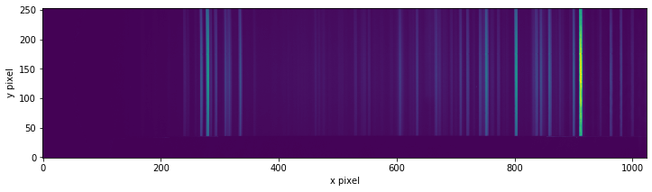
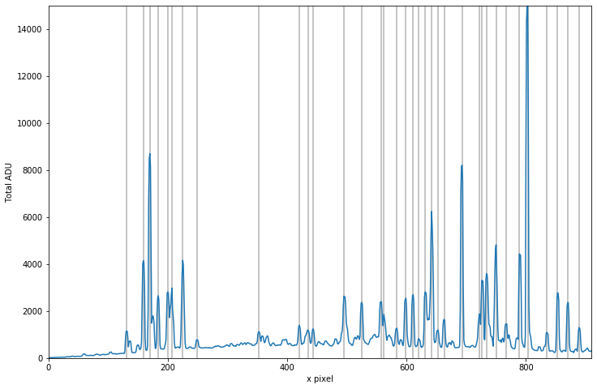
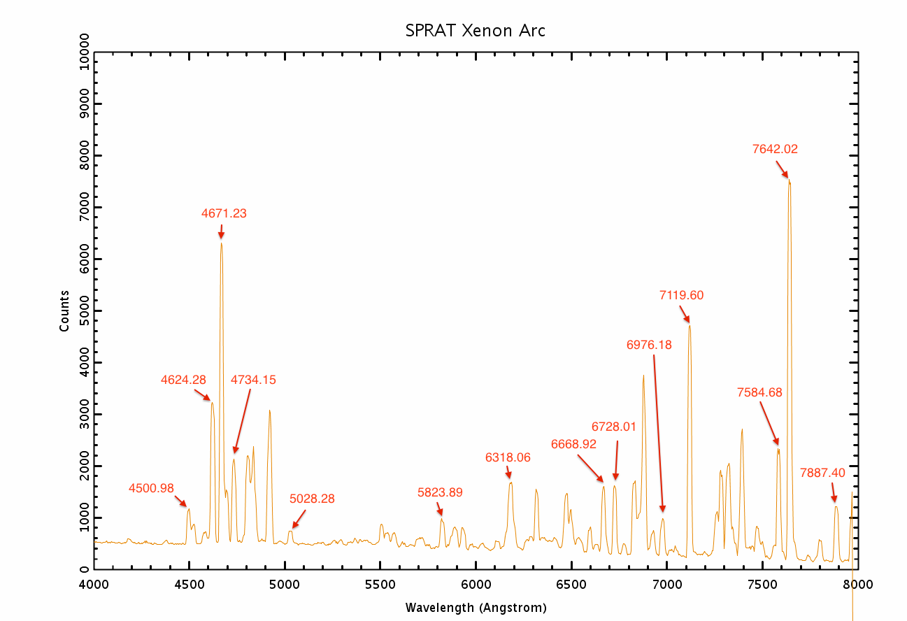
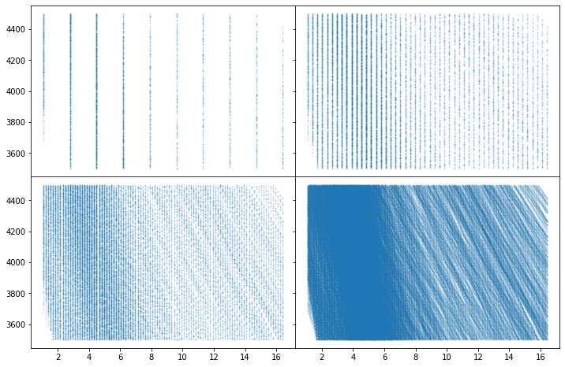
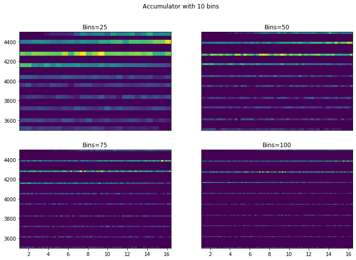
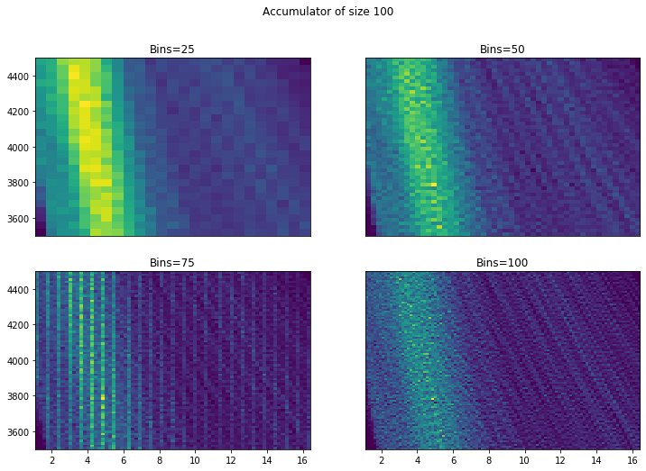
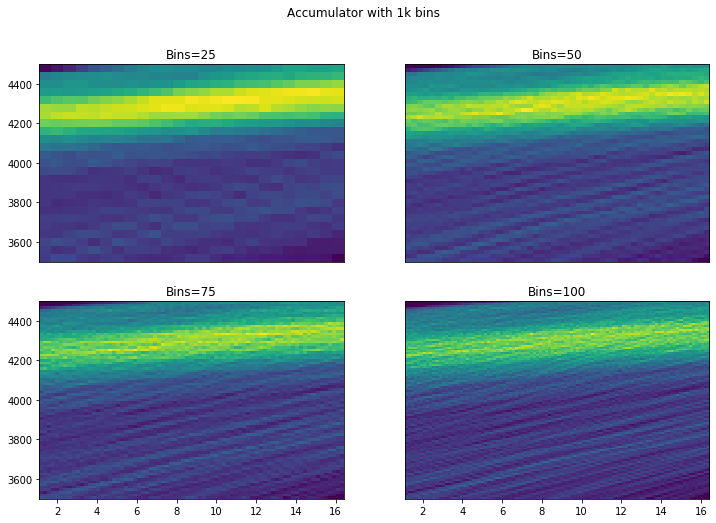
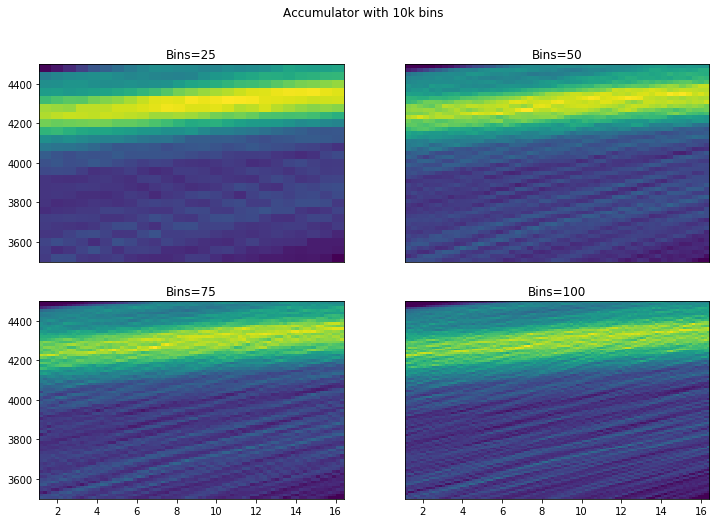
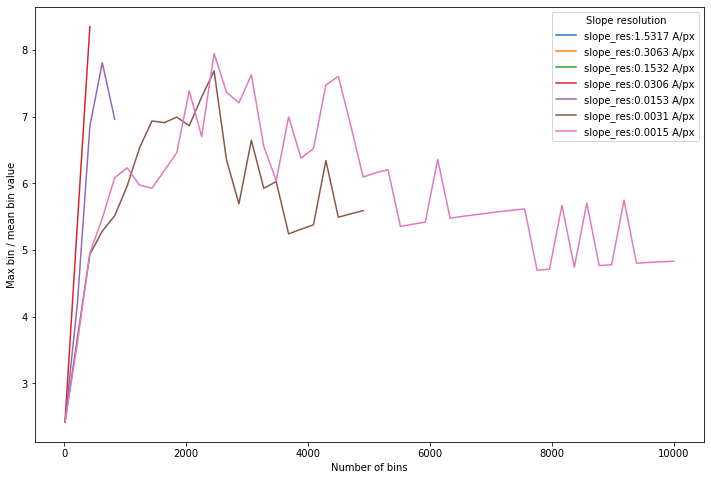
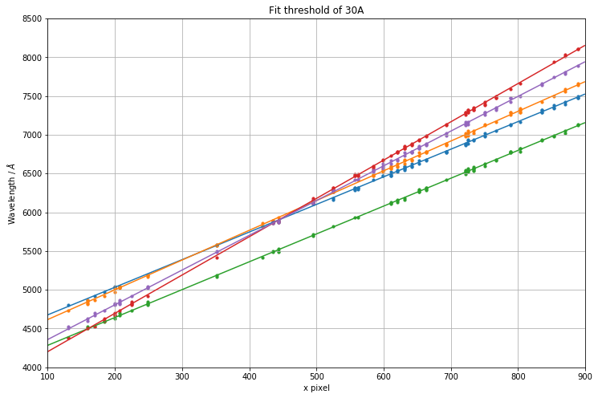

Hough Transform
===============

Hough transform is a technique used for feature extraction in image processing and analysis. The general and more in-depth explanation can be found on `Wikipedia <https://en.wikipedia.org/wiki/Hough_transform>`_. The following explains the specifics of its usage in RASCAL. We will examine the settings for Hough transform, also known as *hyperparameters* and how it is used to perform wavelength calibration. Please note that because for a given spectrum, each pixel has a unique wavelength, we are using the simple :math:`y = m \times x + c` parameterisation instead of using :math:`D = r \times \theta` which allow vertical lines in the hyperparameter space.

A version of this explanation with inline codes is available with the `Jupyter Notebook <https://github.com/jveitchmichaelis/rascal/blob/master/examples/Hough%20Transform.ipynb>`_ at the GitHub repository.

Spectrum and Lines
------------------

Before jumping into the transformation, we need some data. The image below is a 2D image of arc lines dispersed in the x-direction.

The first 110 pixels are trimmed because it is blank. Then, the median of along the y direction is taken to represent the arc spectrum and the locations of the peaks are identified for Hough transform.

This is what the arc should look like (taken from the Liverpool Telescope `SPRAT <http://telescope.livjm.ac.uk/TelInst/Inst/SPRAT/>`_ instrument page). Note the first sizable peak on the left is at 4500A, and the three small but clear peaks to the far right are 7807A, 7887A and 7967A (partly truncated):

Accumulator
-----------

Now we instantiate a ``calibrator``. We can see from the above plot, and recognising some key lines that our range is around 4000 to 8000A. To visualise the process, first, we plot a few 2D Hough ``accumulators`` matrices with different values of the ``num_slopes`` -- 10, 50, 100 and 500, to generate all the possible Hough pairs (gradient-interception pair). The ``accumulators`` look like the following for the 4 values of the slope resolution (clockwise from the top left). Each point on the plot corresponds to the gradient and the interception of the support line that goes through a wavelength-pixel pair within the given tolerance limit.

We have specified a spectral range (4000-8000A), and provided the number of pixels in the spectral direction (914 pix). Rascal guesses sensible values of the intercept depending on how confident your range guess is, e.g. the default of ``range_tolerance`` is 500A, giving the possible range of interception from 3500A to 4500A. The linearity in the pixel-wavelength relation has to be included to allow the gradual change in the gradient from one end to the other of the spectrum.

From this we know that the maximum gradient must be:

.. math::

    &\dfrac{\mathrm{Maximum\ Wavelength} - \mathrm{Tolerance} - \mathrm{Minimum\ Interception}}{\mathrm{Number\ of\ Pixels}\, /\, \mathrm{Linearity\ Tolerance\ Threshold}}\\
    =\, &\dfrac{(8000 + 500) - (4000 - 500)}{914 / 3}\\
    \approx\, &16.41
and the minimum:

.. math::

    &\dfrac{\mathrm{Maximum\ Wavelength} + \mathrm{Tolerance} - \mathrm{Maximum\ Interception}}{\mathrm{Number\ of\ Pixels}\, \times\, \mathrm{Linearity\ Tolerance\ Threshold}}\\
    =\, &\dfrac{(8000 - 500) - (4000 + 500)}{914 \times 3}\\
    \approx\, &1.09

.. note::

    We have chosen to enumerate over dispersion - the algorithm works by choosing a range of dispersion values to check, and finds the intercept values that supports them (i.e. we solve :math:`y = m \times x + c` for :math:`c` given :math:`m`). We could equivalently search over a range of initial wavelengths and calculate what dispersions would support that.

Binning
-------

To better visualise these scattered data points, we can present them in 2D histogram of the accumulators at different resolution. The 4 figures below show from the lowest resolution Hough transform accumulator with 50 gradients to the highest with 10000 gradients:

Two things stand out here. Firstly, it is important to have a high resolution Hough transform so that we do not miss possible solutions. Secondly, more bins are good - we can see from 50+ that we start to identify a possible solution (the small hotspot/peak). However, while there does seem to be an improvement going to around 75 bins, going to 100 isn't visually very different. Similarly there doesn't appear to be a huge advantage in choosing a very small bin

We can do a small grid search over the two variables: slope resolution (defined by the number of slope bins and wavelength range) and the histogram bin resolution.

Goodness-of-fit
---------------

These curves are essentially showing how "good" the best line fit is. We don't want a histogram where there are lots of potential choices. It looks empirically that the number of bins should be around half the number of gradients to maximise contrast. A sensible default of 1000 slopes with 500 bins is appropriate (at least for this dispersion and range).

Threshold setting
-----------------

We want to get a set of points with a high precision - that is, we want as many true positives as possible, at the risk that we have included a few false positives too. So it is important at this stage, that the acceptance threshold is quite high - as much as 50A or even 100A because this does not take into account for the non-linearity. Once we have some first guesses, the solutions can be fine tuned later quickly on a much reduced set of data.

Below illustrate how the threshold can completely throw good/potential solution out of the window.

.. figure:: hough_transform_figure/hough_transform_11.png
