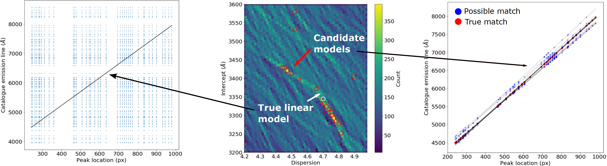

3-minute Summary
================

Working Principle
-----------------

RASCAL begins by **enumerating all possible combinations of input peaks and emission lines** in a catalogue. Emission lines are initially filtered by prior knowledge of the system, for example, approximate dispersion and spectral range. At this point, we assume that any peak could match any catalogue line.

Most spectrometers are linear to first order. We can use the Hough Transform to find line fits to the enumerated peak/emission lines. Peaks in the **Hough Transform** accumulator correspond to lines in Cartesian space that pass through the most points. We constrain the line search given estimates of the system parameters.

The fitted lines effectively show a piece-wise linear fit to the non-linear dispersion of the spectrometer. This is also evident in the accumulator plot as two groups of local maxima. **We therefore choose the most common match for each peak, considering all of the top-N lines**.

The output of RASCAL is a set of matching peak locations (pixels) and lines (wavelengths), and a calibration model. Users are free to select their own fitting function.

    *Left*: All possible combinations of arc lines (wavelengths) and peaks (pixels).

    *Middle*: Peaks in the Hough Transform.

    *Right*: The top 20 linear solutions and the peak/emission line pairs which are agreed to within 15A.

RANSAC & Hough transform
------------------------

**RAN**\ dom **SA**\ mple **C**\ onsensus is a popular algorithm from computer vision, used for performing robiust model fitting in the presence of large numbers of outliers. We use RANSAC to determine corresponding peaks and emission lines, posed as a noisy matching problem.

**Hough Transform** is a technique used for feature extraction in image processing and analysis. In our usage, the solution appears as overdensities in the Hough space.

Combining the two, RANSAC fits a (non-linear) model repeatedly from a minimum random sample of (Hough transformed) points. This process repeats many times, and we keep the best fit. Once RANSAC has produced a best fit solution, we can go through the detected peaks and choose the wavelength from the catalogue which matches it (to within a tolerance limit).

See :ref:`Hough Transform` and :ref:`RANSAC <Random sample consensus (RANSAC)>` in more details.
