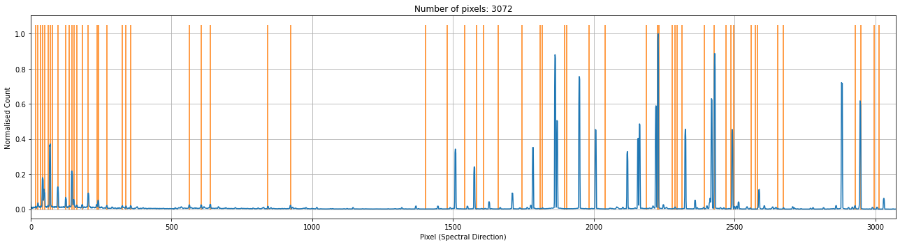
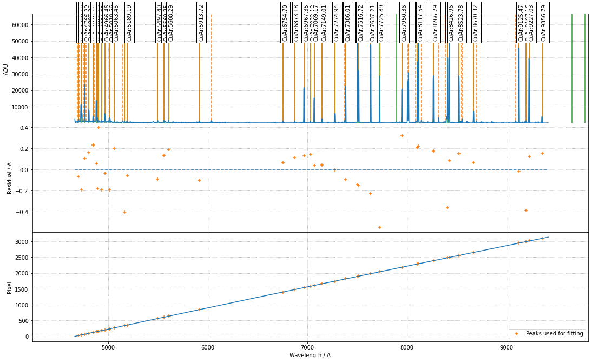
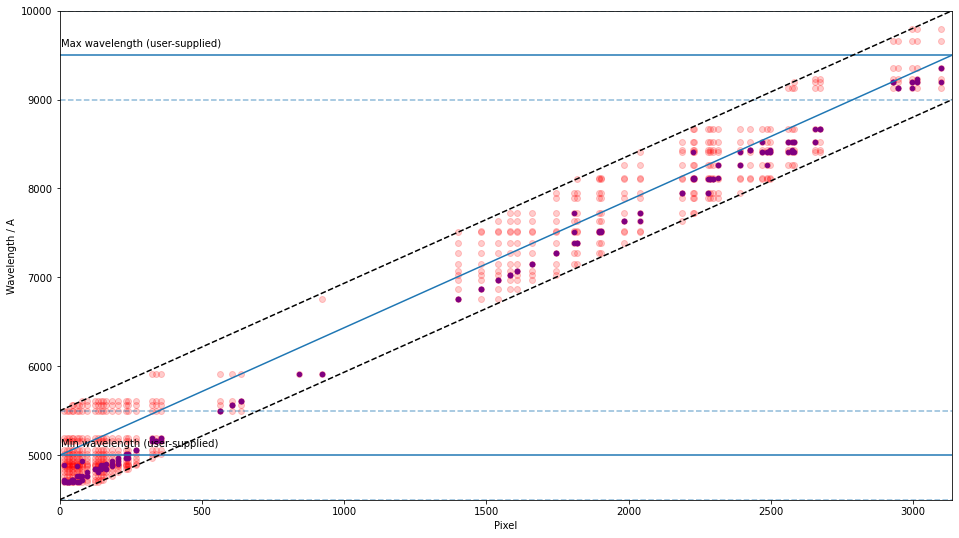

Example - Gemini/GMOSLS
========================

The spectrogrphy `GMOSLS <https://www.gemini.edu/instrumentation/current-instruments/gmos>`_ on the `Gemini Telescope <https://www.gemini.edu/>`_ is another important test instrument we focus on. The testing is performed with the medium/medium-low-resolution grating R400 in long-slit mode. This example also makes use of `bhtomspec <https://bhtom-spec.readthedocs.io/en/latest/>`_ for flattening the arc image (which span over 12 FITS Image HDUs). 

1. Initialise the environment and the line list (see the other examples for using the NIST line list) for the data proecessing

.. code-block:: python

    import numpy as np
    from astropy.io import fits
    from scipy.signal import find_peaks
    from matplotlib import pyplot as plt
    import os
    from scipy import interpolate

    from rascal.calibrator import Calibrator
    from rascal import models
    from rascal import util

    import sys

    atlas = [
        4703.632, 4728.19041, 4766.19677, 4807.36348, 4849.16386, 4881.22627,
        4890.40721, 4906.12088, 4934.58593, 4966.46490, 5018.56194, 5063.44827,
        5163.723, 5189.191, 5497.401, 5560.246, 5608.290, 5913.723, 6754.698,
        6873.185, 6967.352, 7032.190, 7069.167, 7149.012, 7274.940, 7386.014,
        7505.935, 7516.721, 7637.208, 7725.887, 7893.246, 7950.362, 8105.921,
        8117.542, 8266.794, 8410.521, 8426.963, 8523.783, 8670.325, 9125.471,
        9197.161, 9227.03, 9356.787, 9660.435, 9787.186
    ]

    element = ['CuAr'] * len(atlas)

2. Import the `bhtomspec` to work with the GMOS data (`N20181115S0215_flattened.fits` is a flattened output image from bhtomspec) and get the pixel position that is corrected for the chip gaps for Gemini North, or flatten the image yourself and have the chip gaps adjusted, then continue with step 3.

.. code-block:: python

    sys.path.append('../../bhtomspec/GMOS')

    from gmos_fieldflattening import create_pixel_array

    pixels = create_pixel_array('north', 2)
    rawpix_to_pix_itp = interpolate.interp1d(np.arange(len(pixels)), pixels)

    # Load the data
    base_dir = os.path.dirname('.')
    spectrum2D = fits.open(
        os.path.join(base_dir,
                     'data_gemini_gmos/N20181115S0215_flattened.fits'))[0].data

    # Collapse into 1D spectrum between row 110 and 120
    spectrum = np.median(spectrum2D[300:310], axis=0)[::-1]

3. Load the data and identify the arc lines in the middle of the frame. Normally you should be applying the trace from the spectral image onto the arc image

.. code-block:: python

    data = fits.open('data_lt_sprat/v_a_20190516_57_1_0_1.fits')[0].data

    spectrum = np.median(data[110:120], axis=0)

    peaks, _ = find_peaks(spectrum, height=500, distance=5, threshold=None)
    peaks_refined = refine_peaks(spectrum, peaks, window_width=5)

4. Initialise the calibrator and set the properties. There are three sets of properties: (1) the calibrator properties who concerns the highest level setting - e.g. logging and plotting; (2) the Hough transform properties which set the constraints in which the trasnform is performed; (3) the RANSAC properties control the sampling conditions.

.. code-block:: python

    c = Calibrator(peaks_refined, spectrum)

    c.set_calibrator_properties(num_pix=len(spectrum),
                                plotting_library='matplotlib',
                                log_level='info')

    c.set_hough_properties(num_slopes=5000,
                           range_tolerance=500.,
                           xbins=200,
                           ybins=200,
                           min_wavelength=5000.,
                           max_wavelength=9500.)

    c.set_ransac_properties(sample_size=5,
                            top_n_candidate=5)

The following `INFO` should be logged, where the first 3 lines are when the calibrator was initialised, and the last 3 lines are when the calibrator properties were set.

.. code-block:: python

    INFO:rascal.calibrator:num_pix is set to None.
    INFO:rascal.calibrator:pixel_list is set to None.
    INFO:rascal.calibrator:Plotting with matplotlib.
    INFO:rascal.calibrator:num_pix is set to None.
    INFO:rascal.calibrator:pixel_list is set to [0.000e+00 1.000e+00 2.000e+00 ... 3.136e+03 3.137e+03 3.138e+03].
    INFO:rascal.calibrator:Plotting with matplotlib.

5. The extracted arc spectrum and the peaks identified can be plotted with the calibrator. Note that if only peaks are provided, only the orange lines will be plotted.

.. code-block:: python

    c.plot_arc()

6. Add the line list to the calibrator and perform the hough transform on the pixel-wavelength pairs that will be used by the RANSAC sampling and fitting.

.. code-block:: python

    c.load_user_atlas(elements=element,
                      wavelengths=atlas,
                      vacuum=True,
                      pressure=61700.,
                      temperature=276.55,
                      relative_humidity=4.)
    c.do_hough_transform()

6. Perform polynomial fit on samples drawn from RANSAC, the deafult option is to fit with polynomial function.

.. code-block:: python

    fit_coeff, rms, residual, peak_utilisation = c.fit(max_tries=1000, fit_deg=4)

    # Plot the solution
    c.plot_fit(fit_coeff, spectrum, plot_atlas=True, log_spectrum=False, tolerance=5.)

with some INFO output looking like this:

.. code-block:: python

    INFO:rascal.calibrator:Peak at: 4690.432939431677 A
    INFO:rascal.calibrator:Peak at: 4703.69698080062 A
    INFO:rascal.calibrator:- matched to 4703.6319466224995 A
    INFO:rascal.calibrator:Peak at: 4716.026520809748 A
    INFO:rascal.calibrator:Peak at: 4728.383743644213 A
    INFO:rascal.calibrator:- matched to 4728.190356343808 A
    INFO:rascal.calibrator:Peak at: 4737.097090466034 A
    INFO:rascal.calibrator:Peak at: 4757.491217560396 A
    INFO:rascal.calibrator:Peak at: 4766.093311886265 A
    INFO:rascal.calibrator:- matched to 4766.196715912505 A
    INFO:rascal.calibrator:Peak at: 4780.210922721128 A
    INFO:rascal.calibrator:Peak at: 4807.206845286494 A
    INFO:rascal.calibrator:- matched to 4807.36342544534 A
    INFO:rascal.calibrator:Peak at: 4848.935535742634 A
    INFO:rascal.calibrator:- matched to 4849.163804970983 A
    INFO:rascal.calibrator:Peak at: 4866.990349869678 A
    INFO:rascal.calibrator:Peak at: 4881.167498144336 A
    INFO:rascal.calibrator:- matched to 4881.226214607134 A
    INFO:rascal.calibrator:Peak at: 4890.591318605304 A
    INFO:rascal.calibrator:- matched to 4890.407154502948 A
    INFO:rascal.calibrator:Peak at: 4905.728124841728 A
    INFO:rascal.calibrator:- matched to 4906.120824324627 A
    INFO:rascal.calibrator:Peak at: 4934.778999493386 A
    INFO:rascal.calibrator:- matched to 4934.585874001602 A
    INFO:rascal.calibrator:Peak at: 4966.500342895015 A
    INFO:rascal.calibrator:- matched to 4966.464843639834 A
    INFO:rascal.calibrator:Peak at: 5011.146235531303 A
    INFO:rascal.calibrator:Peak at: 5018.756785319058 A
    INFO:rascal.calibrator:- matched to 5018.561883048629 A
    INFO:rascal.calibrator:Peak at: 5063.247797723866 A
    INFO:rascal.calibrator:- matched to 5063.448212539252 A
    INFO:rascal.calibrator:Peak at: 5144.755132831136 A
    INFO:rascal.calibrator:Peak at: 5164.128717766755 A
    INFO:rascal.calibrator:- matched to 5163.722941401321 A
    INFO:rascal.calibrator:Peak at: 5189.253818523486 A
    INFO:rascal.calibrator:- matched to 5189.190941112306 A
    INFO:rascal.calibrator:Peak at: 5497.49298195608 A
    INFO:rascal.calibrator:- matched to 5497.400937614694 A
    INFO:rascal.calibrator:Peak at: 5560.11042416126 A
    INFO:rascal.calibrator:- matched to 5560.24593690152 A
    INFO:rascal.calibrator:Peak at: 5608.100625609014 A
    INFO:rascal.calibrator:- matched to 5608.289936356309 A
    INFO:rascal.calibrator:Peak at: 5913.824836948544 A
    INFO:rascal.calibrator:- matched to 5913.722932890211 A
    INFO:rascal.calibrator:Peak at: 6033.807028259769 A
    INFO:rascal.calibrator:Peak at: 6754.635766825111 A
    INFO:rascal.calibrator:- matched to 6754.6979233467055 A
    INFO:rascal.calibrator:Peak at: 6873.071461159328 A
    INFO:rascal.calibrator:- matched to 6873.184922002098 A
    INFO:rascal.calibrator:Peak at: 6967.222796782309 A
    INFO:rascal.calibrator:- matched to 6967.351920933476 A
    INFO:rascal.calibrator:Peak at: 7032.048764629298 A
    INFO:rascal.calibrator:- matched to 7032.189920197685 A
    INFO:rascal.calibrator:Peak at: 7069.13066654799 A
    INFO:rascal.calibrator:- matched to 7069.166919778066 A
    INFO:rascal.calibrator:Peak at: 7148.973051212137 A
    INFO:rascal.calibrator:- matched to 7149.011918871972 A
    INFO:rascal.calibrator:Peak at: 7274.942712866794 A
    INFO:rascal.calibrator:- matched to 7274.939917442923 A
    INFO:rascal.calibrator:Peak at: 7374.290810404373 A
    INFO:rascal.calibrator:Peak at: 7386.110457538571 A
    INFO:rascal.calibrator:- matched to 7386.013916182439 A
    INFO:rascal.calibrator:Peak at: 7506.080265224655 A
    INFO:rascal.calibrator:- matched to 7505.934914821559 A
    INFO:rascal.calibrator:Peak at: 7516.8721166291125 A
    INFO:rascal.calibrator:- matched to 7516.720914699156 A
    INFO:rascal.calibrator:Peak at: 7637.436474845539 A
    INFO:rascal.calibrator:- matched to 7637.207913331853 A
    INFO:rascal.calibrator:Peak at: 7726.433567729615 A
    INFO:rascal.calibrator:- matched to 7725.886912325511 A
    INFO:rascal.calibrator:Peak at: 7950.045808427023 A
    INFO:rascal.calibrator:- matched to 7950.361909778136 A
    INFO:rascal.calibrator:Peak at: 8012.828184407577 A
    INFO:rascal.calibrator:Peak at: 8017.891550233657 A
    INFO:rascal.calibrator:Peak at: 8090.176412302726 A
    INFO:rascal.calibrator:Peak at: 8105.717761499685 A
    INFO:rascal.calibrator:- matched to 8105.92090801283 A
    INFO:rascal.calibrator:Peak at: 8117.323357964481 A
    INFO:rascal.calibrator:- matched to 8117.541907880954 A
    INFO:rascal.calibrator:Peak at: 8146.552760784422 A
    INFO:rascal.calibrator:Peak at: 8266.617881247412 A
    INFO:rascal.calibrator:- matched to 8266.79390618722 A
    INFO:rascal.calibrator:Peak at: 8319.802992049212 A
    INFO:rascal.calibrator:Peak at: 8384.554625340576 A
    INFO:rascal.calibrator:Peak at: 8410.885574971622 A
    INFO:rascal.calibrator:- matched to 8410.520904556186 A
    INFO:rascal.calibrator:Peak at: 8426.881696730394 A
    INFO:rascal.calibrator:- matched to 8426.962904369599 A
    INFO:rascal.calibrator:Peak at: 8523.632359509633 A
    INFO:rascal.calibrator:- matched to 8523.78290327087 A
    INFO:rascal.calibrator:Peak at: 8547.188318167655 A
    INFO:rascal.calibrator:Peak at: 8557.891662766575 A
    INFO:rascal.calibrator:Peak at: 8670.25988469748 A
    INFO:rascal.calibrator:- matched to 8670.324901607892 A
    INFO:rascal.calibrator:Peak at: 8698.877173222663 A
    INFO:rascal.calibrator:Peak at: 9093.532686785864 A
    INFO:rascal.calibrator:Peak at: 9125.49128474281 A
    INFO:rascal.calibrator:- matched to 9125.470896442828 A
    INFO:rascal.calibrator:Peak at: 9197.54730560129 A
    INFO:rascal.calibrator:- matched to 9197.16089562928 A
    INFO:rascal.calibrator:Peak at: 9226.906860894214 A
    INFO:rascal.calibrator:- matched to 9227.029895290323 A
    INFO:rascal.calibrator:Peak at: 9356.635155506821 A
    INFO:rascal.calibrator:- matched to 9356.786893817822 A

7. Quantify the quality of fit

.. code-block:: python

    print("RMS: {}".format(rms))
    print("Stdev error: {} A".format(np.abs(residual).std()))
    print("Peaks utilisation rate: {}%".format(peak_utilisation*100))

with these output

.. code-block:: python

    RMS: 0.20199868705514198
    Stdev error: 0.20199868705514198 A
    Peaks utilisation rate: 93.33333333333333%

8. We can also inspect the search space in the Hough parameter-space where the samples were drawn by running:

.. code-block:: python

    c.plot_search_space()

