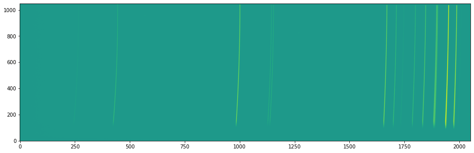
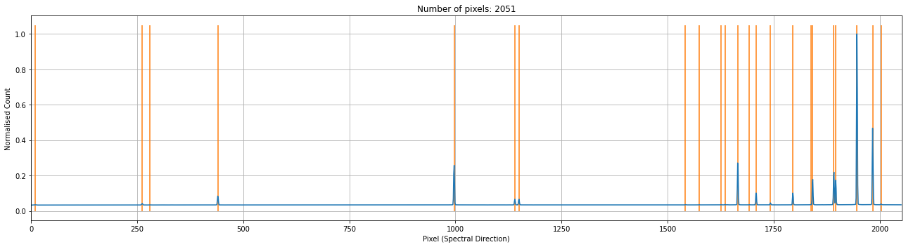
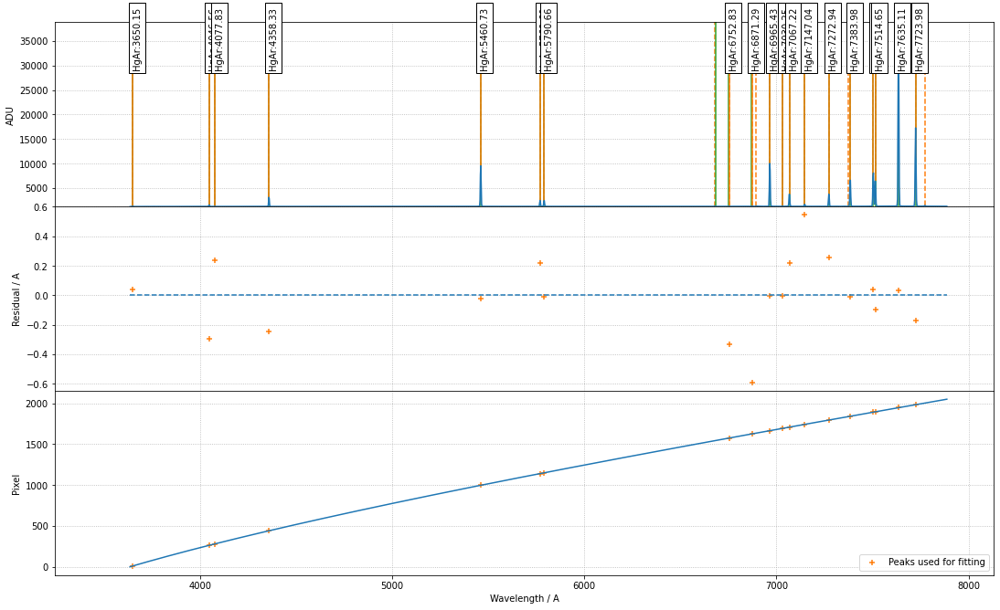
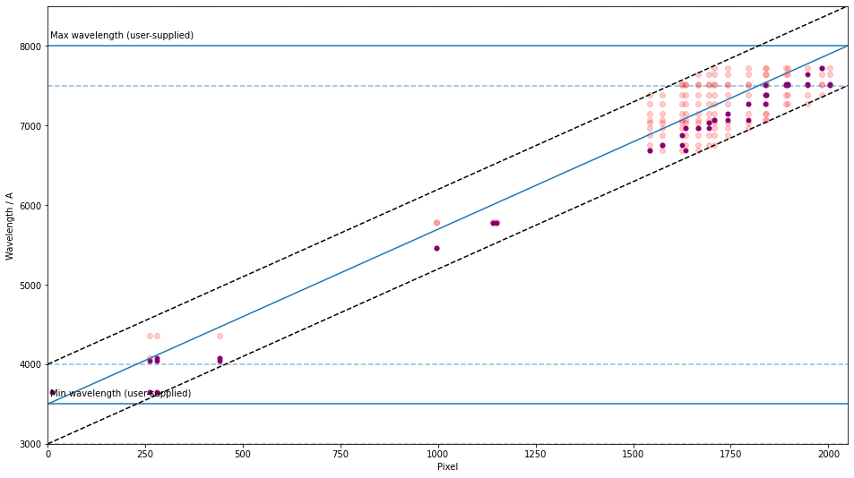

Example - GTC/OSIRIS
====================

The spectrogrphy `OSIRIS <http://www.gtc.iac.es/instruments/osiris/#Longslit_Spectroscopy>`_ is one of the most used instrument on the Gran Telescopio Canarias (`GTC <(http://www.gtc.iac.es/>`_). In this example, we wavelength calibration the R1000B HgAr arc.

1. Initialise the environment and the line list (see the other examples for using the NIST line list) for the data proecessing

.. code-block:: python

    from astropy.io import fits
    import matplotlib.pyplot as plt
    import numpy as np
    from scipy.signal import find_peaks
    from scipy.signal import resample

    from rascal.calibrator import Calibrator
    from rascal.util import refine_peaks

    atlas = [
        3650.153, 4046.563, 4077.831, 4358.328, 5460.735, 5769.598, 5790.663,
        6682.960, 6752.834, 6871.289, 6965.431, 7030.251, 7067.218, 7147.042,
        7272.936, 7383.981, 7503.869, 7514.652, 7635.106, 7723.98
    ]
    element = ['HgAr'] * len(atlas)

2. Load and inspect the arc image

.. code-block:: python

    data = fits.open('data_gtc_osiris/0002672523-20200911-OSIRIS-OsirisCalibrationLamp.fits')[1]

    plt.figure(1, figsize=(16,5))
    plt.imshow(np.log(data.data), aspect='auto', origin='lower')
    plt.tight_layout()

3. Normally you should be applying the trace from the spectral image onto the arc image, but in this example, we identify the arc lines in the middle of the frame. 

.. code-block:: python

    spectrum = np.median(data.data.T[550:570], axis=0)

    peaks, _ = find_peaks(spectrum, height=1250, prominence=20, distance=3, threshold=None)
    peaks_refined = refine_peaks(spectrum, peaks, window_width=3)

4. Initialise the calibrator and set the properties. There are three sets of properties: (1) the calibrator properties who concerns the highest level setting - e.g. logging and plotting; (2) the Hough transform properties which set the constraints in which the trasnform is performed; (3) the RANSAC properties control the sampling conditions.

.. code-block:: python

    c.set_hough_properties(num_slopes=2000,
                           xbins=100,
                           ybins=100,
                           min_wavelength=3500.,
                           max_wavelength=8000.,
                           range_tolerance=500.,
                           linearity_tolerance=50)

    c.load_user_atlas(elements=element,
                      wavelengths=atlas,
                      constrain_poly=True)

    c.set_ransac_properties(sample_size=5,
                            top_n_candidate=5,
                            linear=True,
                            filter_close=True,
                            ransac_tolerance=5,
                            candidate_weighted=True,
                            hough_weight=1.0)

    c.do_hough_transform()

The following `INFO` should be logged, where the first 3 lines are when the calibrator was initialised, and the last 3 lines are when the calibrator properties were set.

.. code-block:: python

    INFO:rascal.calibrator:num_pix is set to None.
    INFO:rascal.calibrator:pixel_list is set to None.
    INFO:rascal.calibrator:Plotting with matplotlib.
    INFO:rascal.calibrator:num_pix is set to 2051.
    INFO:rascal.calibrator:pixel_list is set to None.
    INFO:rascal.calibrator:Plotting with matplotlib.

5. The extracted arc spectrum and the peaks identified can be plotted with the calibrator. Note that if only peaks are provided, only the orange lines will be plotted.

.. code-block:: python

    c.plot_arc()

6. Add the line list to the calibrator and perform the hough transform on the pixel-wavelength pairs that will be used by the RANSAC sampling and fitting.

.. code-block:: python

    c.load_user_atlas(elements=element,
                      wavelengths=atlas,
                      constrain_poly=True)
    c.do_hough_transform()

6. Perform polynomial fit on samples drawn from RANSAC, the deafult option is to fit with polynomial function.

.. code-block:: python

    fit_coeff, rms, residual, peak_utilisation = c.fit(max_tries=200, fit_tolerance=10., fit_deg=4)

    c.plot_fit(fit_coeff,
               plot_atlas=True,
               log_spectrum=False,
               tolerance=5.)

with some INFO output looking like this:

.. code-block:: python

    INFO:rascal.calibrator:Peak at: 3650.115449538473 A
    INFO:rascal.calibrator:- matched to 3650.153 A
    INFO:rascal.calibrator:Peak at: 4046.8620798203365 A
    INFO:rascal.calibrator:- matched to 4046.563 A
    INFO:rascal.calibrator:Peak at: 4077.595238720406 A
    INFO:rascal.calibrator:- matched to 4077.831 A
    INFO:rascal.calibrator:Peak at: 4358.576445488649 A
    INFO:rascal.calibrator:- matched to 4358.328 A
    INFO:rascal.calibrator:Peak at: 5460.7567985483165 A
    INFO:rascal.calibrator:- matched to 5460.735 A
    INFO:rascal.calibrator:Peak at: 5769.381771912414 A
    INFO:rascal.calibrator:- matched to 5769.598 A
    INFO:rascal.calibrator:Peak at: 5790.674908711722 A
    INFO:rascal.calibrator:- matched to 5790.663 A
    INFO:rascal.calibrator:Peak at: 6677.195577604758 A
    INFO:rascal.calibrator:Peak at: 6753.169173651684 A
    INFO:rascal.calibrator:- matched to 6752.834 A
    INFO:rascal.calibrator:Peak at: 6871.881456822988 A
    INFO:rascal.calibrator:- matched to 6871.289 A
    INFO:rascal.calibrator:Peak at: 6894.527274171375 A
    INFO:rascal.calibrator:Peak at: 6965.436232273663 A
    INFO:rascal.calibrator:- matched to 6965.431 A
    INFO:rascal.calibrator:Peak at: 7030.256183107306 A
    INFO:rascal.calibrator:- matched to 7030.251 A
    INFO:rascal.calibrator:Peak at: 7067.0001611640355 A
    INFO:rascal.calibrator:- matched to 7067.218 A
    INFO:rascal.calibrator:Peak at: 7146.4973429914635 A
    INFO:rascal.calibrator:- matched to 7147.042 A
    INFO:rascal.calibrator:Peak at: 7272.679474233918 A
    INFO:rascal.calibrator:- matched to 7272.936 A
    INFO:rascal.calibrator:Peak at: 7373.953964433149 A
    INFO:rascal.calibrator:Peak at: 7383.992970996112 A
    INFO:rascal.calibrator:- matched to 7383.981 A
    INFO:rascal.calibrator:Peak at: 7503.831035910258 A
    INFO:rascal.calibrator:- matched to 7503.869 A
    INFO:rascal.calibrator:Peak at: 7514.750835501081 A
    INFO:rascal.calibrator:- matched to 7514.652 A
    INFO:rascal.calibrator:Peak at: 7635.073536260965 A
    INFO:rascal.calibrator:- matched to 7635.106 A
    INFO:rascal.calibrator:Peak at: 7724.151294456838 A
    INFO:rascal.calibrator:- matched to 7723.98 A
    INFO:rascal.calibrator:Peak at: 7772.136274228791 A

7. Quantify the quality of fit

.. code-block:: python

    print("RMS: {}".format(rms))
    print("Stdev error: {} A".format(np.abs(residual).std()))
    print("Peaks utilisation rate: {}%".format(peak_utilisation*100))

with these output

.. code-block:: python

    RMS: 0.263069686012686
    Stdev error: 0.1791648865435056 A
    Peaks utilisation rate: 80.0%

8. We can also inspect the search space in the Hough parameter-space where the samples were drawn by running:

.. code-block:: python

    c.plot_search_space()

