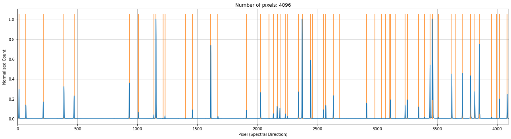
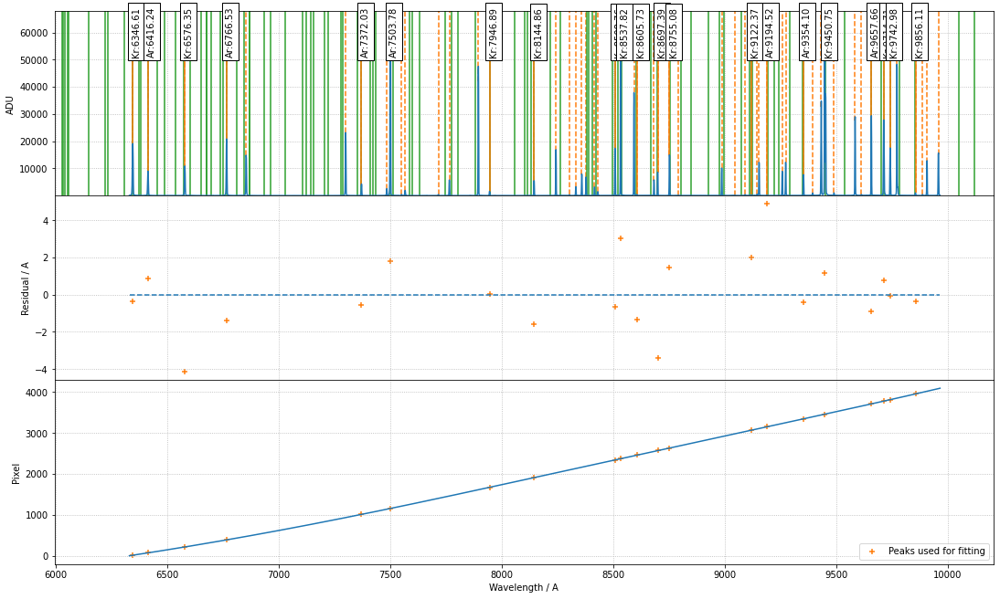
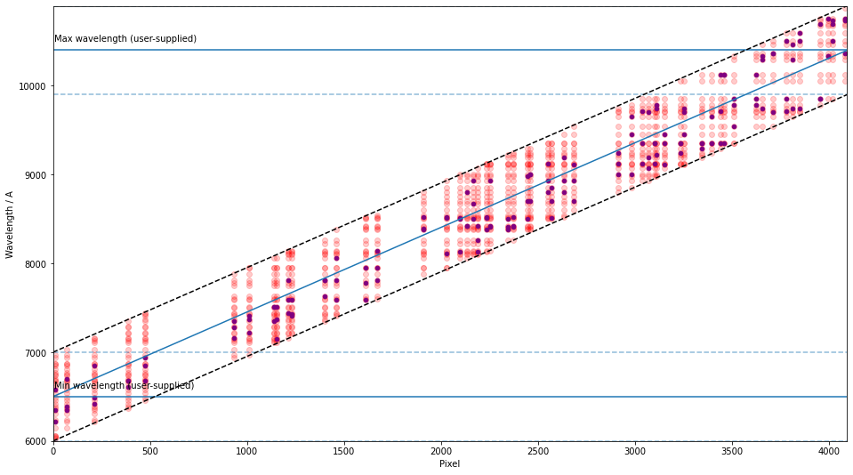

Example - Keck/DEIMOS
=====================

This example performs wavelength calibration on DEep Imaging Multi-Object Spectrograph (`DEIMOS <https://www2.keck.hawaii.edu/inst/deimos/>`_ installed on the `Keck Telescope <https://www2.keck.hawaii.edu/>`_) with the 830G grating, containing Ne, Ar abd Kr without providing a line list. The 1D arc spectrum is taken from `pypeit <https://github.com/pypeit/PypeIt.git>`_ on GitHub, as of 6 April 2020.

1. Initialise the environment and the line list (see the other examples for using the NIST line list) for the data proecessing

.. code-block:: python

    import json
    import numpy as np
    from scipy.signal import find_peaks

    from rascal.calibrator import Calibrator
    from rascal.util import refine_peaks

2. Load the arc spectrum and identify the arc lines

.. code-block:: python

    spectrum_json = json.load(open('data_keck_deimos/keck_deimos_830g_l_PYPIT.json'))
    spectrum = np.array(spectrum_json['spec'])

    peaks, _ = find_peaks(spectrum, prominence=200, distance=10)
    peaks_refined = refine_peaks(spectrum, peaks, window_width=3)

3. Initialise the calibrator and set the properties. There are three sets of properties: (1) the calibrator properties who concerns the highest level setting - e.g. logging and plotting; (2) the Hough transform properties which set the constraints in which the trasnform is performed; (3) the RANSAC properties control the sampling conditions.

.. code-block:: python

    c = Calibrator(peaks_refined, spectrum)

    c.set_calibrator_properties(num_pix=len(spectrum),
                                plotting_library='matplotlib',
                                log_level='info')

    c.set_hough_properties(num_slopes=10000,
                           xbins=200,
                           ybins=200,
                           min_wavelength=6500.,
                           max_wavelength=10500.,
                           range_tolerance=500.,
                           linearity_tolerance=50)

    c.set_ransac_properties(sample_size=5,
                            top_n_candidate=5,
                            linear=True,
                            filter_close=True,
                            ransac_tolerance=5,
                            candidate_weighted=True,
                            hough_weight=1.0)

    c.do_hough_transform()

The following `INFO` should be logged, where the first 3 lines are when the calibrator was initialised, and the last 3 lines are when the calibrator properties were set.

.. code-block:: python

    INFO:rascal.calibrator:num_pix is set to None.
    INFO:rascal.calibrator:pixel_list is set to None.
    INFO:rascal.calibrator:Plotting with matplotlib.
    INFO:rascal.calibrator:num_pix is set to 4096.
    INFO:rascal.calibrator:pixel_list is set to None.
    INFO:rascal.calibrator:Plotting with matplotlib.

4. The extracted arc spectrum and the peaks identified can be plotted with the calibrator. Note that if only peaks are provided, only the orange lines will be plotted.

.. code-block:: python

    c.plot_arc()

5. Add the line list downloaded from NIST to the calibrator and perform the hough transform on the pixel-wavelength pairs that will be used by the RANSAC sampling and fitting.

.. code-block:: python

    c.add_atlas(["He", "Ar", "Kr"],
                min_intensity=15,
                min_intensity=1000.,
                pressure=70000.,
                temperature=285.)
    c.do_hough_transform()

6. Perform polynomial fit on samples drawn from RANSAC, the deafult option is to fit with polynomial function.

.. code-block:: python

    (fit_coeff, matched_peaks, matched_atlas, rms, residual, peak_utilisation,
     atlas_utilisation) = c.fit(max_tries=1000)
    c.plot_fit(fit_coeff,
               spectrum=spectrum,
               plot_atlas=True,
               log_spectrum=False,
               tolerance=10.)

with some INFO output looking like this:

.. code-block:: python

    INFO:rascal.calibrator:Peak at: 6181.21116563306 A
    INFO:rascal.calibrator:Peak at: 6256.333529966452 A
    INFO:rascal.calibrator:Peak at: 6439.811724316869 A
    INFO:rascal.calibrator:Peak at: 6652.09949066169 A
    INFO:rascal.calibrator:- matched to 6652.158203125 A
    INFO:rascal.calibrator:Peak at: 6753.108192719367 A
    INFO:rascal.calibrator:- matched to 6752.755859375 A
    INFO:rascal.calibrator:Peak at: 7284.4291622913315 A
    INFO:rascal.calibrator:- matched to 7287.173828125 A
    INFO:rascal.calibrator:Peak at: 7371.7744273814915 A
    INFO:rascal.calibrator:- matched to 7372.0283203125 A
    INFO:rascal.calibrator:Peak at: 7513.2846911492425 A
    INFO:rascal.calibrator:- matched to 7514.5595703125 A
    INFO:rascal.calibrator:Peak at: 7533.316917280944 A
    INFO:rascal.calibrator:Peak at: 7597.325991944456 A
    INFO:rascal.calibrator:- matched to 7601.45166015625 A
    INFO:rascal.calibrator:Peak at: 7616.837505897713 A
    INFO:rascal.calibrator:Peak at: 7807.543435151655 A
    INFO:rascal.calibrator:- matched to 7806.42431640625 A
    INFO:rascal.calibrator:Peak at: 7871.742919008845 A
    INFO:rascal.calibrator:Peak at: 8041.538650167087 A
    INFO:rascal.calibrator:Peak at: 8107.7513815373395 A
    INFO:rascal.calibrator:- matched to 8103.58984375 A
    INFO:rascal.calibrator:Peak at: 8373.173467243614 A
    INFO:rascal.calibrator:Peak at: 8504.898771185366 A
    INFO:rascal.calibrator:- matched to 8508.763671875 A
    INFO:rascal.calibrator:Peak at: 8585.472074103302 A
    INFO:rascal.calibrator:Peak at: 8625.137975870266 A
    INFO:rascal.calibrator:Peak at: 8661.21940010808 A
    INFO:rascal.calibrator:Peak at: 8687.226193001674 A
    INFO:rascal.calibrator:Peak at: 8738.248959745788 A
    INFO:rascal.calibrator:Peak at: 8758.17852455273 A
    INFO:rascal.calibrator:- matched to 8755.0810546875 A
    INFO:rascal.calibrator:Peak at: 8862.992736150627 A
    INFO:rascal.calibrator:Peak at: 8897.362194686848 A
    INFO:rascal.calibrator:Peak at: 8978.409139377678 A
    INFO:rascal.calibrator:- matched to 8977.8681640625 A
    INFO:rascal.calibrator:Peak at: 8995.427783056684 A
    INFO:rascal.calibrator:- matched to 8999.0712890625 A
    INFO:rascal.calibrator:Peak at: 9099.958999233066 A
    INFO:rascal.calibrator:Peak at: 9122.555380323614 A
    INFO:rascal.calibrator:- matched to 9122.3662109375 A
    INFO:rascal.calibrator:Peak at: 9194.145054206449 A
    INFO:rascal.calibrator:- matched to 9194.5166015625 A
    INFO:rascal.calibrator:Peak at: 9249.269222476234 A
    INFO:rascal.calibrator:Peak at: 9510.487993935229 A
    INFO:rascal.calibrator:Peak at: 9588.910006488015 A
    INFO:rascal.calibrator:Peak at: 9651.46472100934 A
    INFO:rascal.calibrator:Peak at: 9687.974467875612 A
    INFO:rascal.calibrator:Peak at: 9722.775033426266 A
    INFO:rascal.calibrator:Peak at: 9734.57822981183 A
    INFO:rascal.calibrator:Peak at: 9780.201795417905 A
    INFO:rascal.calibrator:- matched to 9784.37109375 A
    INFO:rascal.calibrator:Peak at: 9872.315086684568 A
    INFO:rascal.calibrator:Peak at: 9892.726457724415 A
    INFO:rascal.calibrator:Peak at: 9997.754248989899 A
    INFO:rascal.calibrator:Peak at: 10051.246817850328 A
    INFO:rascal.calibrator:- matched to 10051.9287109375 A
    INFO:rascal.calibrator:Peak at: 10101.391516626534 A
    INFO:rascal.calibrator:Peak at: 10121.71692116084 A
    INFO:rascal.calibrator:- matched to 10120.8193359375 A
    INFO:rascal.calibrator:Peak at: 10175.549623735413 A
    INFO:rascal.calibrator:Peak at: 10297.004370039842 A
    INFO:rascal.calibrator:- matched to 10296.7880859375 A
    INFO:rascal.calibrator:Peak at: 10333.286701702546 A
    INFO:rascal.calibrator:- matched to 10332.5771484375 A
    INFO:rascal.calibrator:Peak at: 10389.359445544913 A
    INFO:rascal.calibrator:Peak at: 10459.030756555107 A
    INFO:rascal.calibrator:Peak at: 10495.358328803779 A
    INFO:rascal.calibrator:Peak at: 10533.23093013465 A
    INFO:rascal.calibrator:Peak at: 10635.260454507756 A
    INFO:rascal.calibrator:Peak at: 10674.011112594191 A
    INFO:rascal.calibrator:- matched to 10673.4189453125 A
    INFO:rascal.calibrator:Peak at: 10698.018361022285 A
    INFO:rascal.calibrator:- matched to 10699.181640625 A
    INFO:rascal.calibrator:Peak at: 10759.154132550711 A
    INFO:rascal.calibrator:- matched to 10759.015625 A

7. Quantify the quality of fit

.. code-block:: python

    print("RMS: {}".format(rms))
    print("Stdev error: {} A".format(np.abs(residual).std()))
    print("Peaks utilisation rate: {}%".format(peak_utilisation*100))
    print("Atlas utilisation rate: {}%".format(atlas_utilisation*100))

where the low numer of peaks utilisation suggests it may be a good fit by chance for the 1/3 of all the peaks, or confusion of the peaks causes the problem. These values alone cannot tell which is the case here and the diagnotic plot should be inspected to confirm the quality of fit.

8. We can also inspect the search space in the Hough parameter-space where the samples were drawn by running:

.. code-block:: python

    c.plot_search_space()

