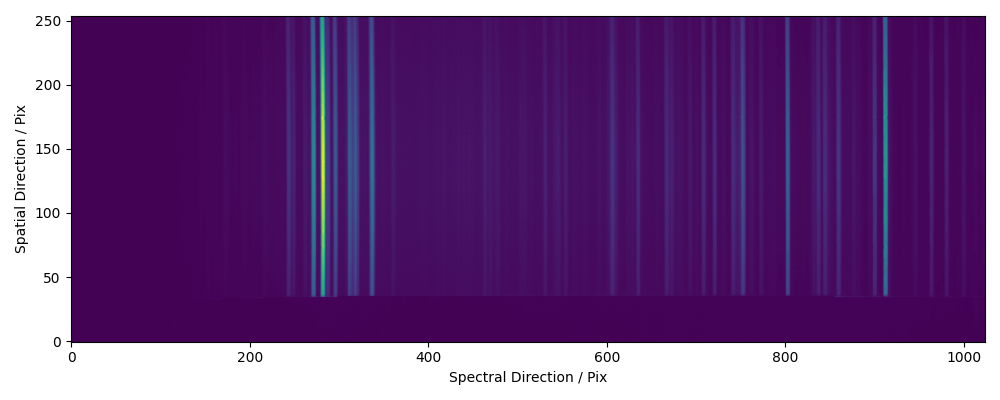
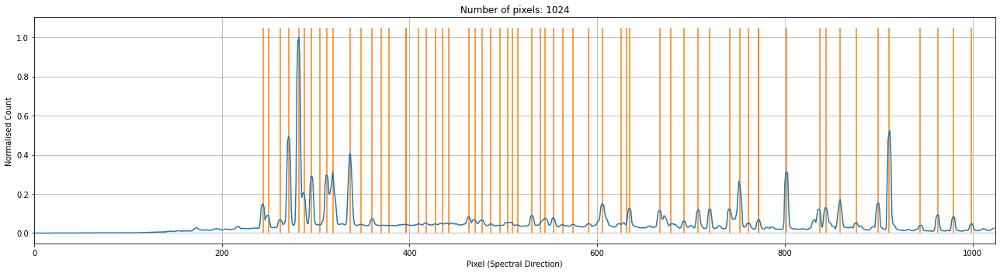
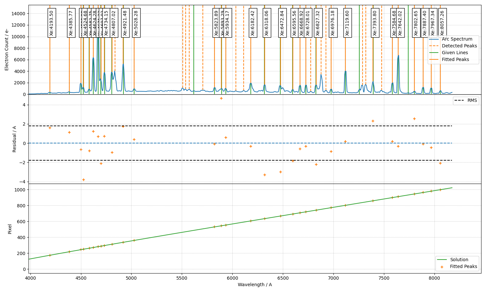

Example - LT/SPRAT
==================

The spectrogrphy `SPRAT <http://telescope.livjm.ac.uk/TelInst/Inst/SPRAT/>`_ on the `Liverpool Telescope <(http://telescope.livjm.ac.uk/>`_ is our primary testing instrument. It is a low-resolution high-throughput spectrograph employing a VPH grating and prism (grism). In the following, we explain the wavelength calibration procedure step-by-step.

1. Initialise the environment and the line list (see the other examples for using the NIST line list) for the data proecessing

.. code-block:: python

    import matplotlib.pyplot as plt
    import numpy as np
    from astropy.io import fits
    from scipy.signal import find_peaks
    from scipy.signal import resample

    from rascal.calibrator import Calibrator
    from rascal.util import refine_peaks

    atlas = [
        4193.5, 4385.77, 4500.98, 4524.68, 4582.75, 4624.28, 4671.23, 4697.02,
        4734.15, 4807.02, 4921.48, 5028.28, 5618.88, 5823.89, 5893.29, 5934.17,
        6182.42, 6318.06, 6472.841, 6595.56, 6668.92, 6728.01, 6827.32, 6976.18,
        7119.60, 7257.9, 7393.8, 7584.68, 7642.02, 7740.31, 7802.65, 7887.40,
        7967.34, 8057.258
    ]

    element = ['Xe'] * len(atlas)

2. Load and inspect the arc image

.. code-block:: python

    data = fits.open('data_lt_sprat/v_a_20190516_57_1_0_1.fits')[0].data

    plt.figure(1, figsize=(10, 4))
    plt.imshow(np.log10(data.data), aspect='auto', origin='lower')
    plt.tight_layout()

3. Normally you should be applying the trace from the spectral image onto the arc image, but in this example, we identify the arc lines in the middle of the frame. 

.. code-block:: python

    spectrum = np.median(data[110:120], axis=0)

    peaks, _ = find_peaks(spectrum, height=500, distance=5, threshold=None)
    peaks_refined = refine_peaks(spectrum, peaks, window_width=5)

4. Initialise the calibrator and set the properties. There are three sets of properties: (1) the calibrator properties who concerns the highest level setting - e.g. logging and plotting; (2) the Hough transform properties which set the constraints in which the trasnform is performed; (3) the RANSAC properties control the sampling conditions.

.. code-block:: python

    c = Calibrator(peaks_refined, spectrum)

    c.set_calibrator_properties(num_pix=len(spectrum),
                                plotting_library='matplotlib',
                                log_level='info')

    c.set_hough_properties(num_slopes=5000,
                           xbins=100,
                           ybins=100,
                           min_wavelength=3500.,
                           max_wavelength=8000.,
                           range_tolerance=500.,
                           linearity_tolerance=50)

    c.set_ransac_properties(sample_size=5,
                            top_n_candidate=5,
                            filter_close=True,
                            ransac_tolerance=5,
                            candidate_weighted=True,
                            hough_weight=1.0)

The following `INFO` should be logged, where the first 3 lines are when the calibrator was initialised, and the last 3 lines are when the calibrator properties were set.

.. code-block:: python

    INFO:rascal.calibrator:num_pix is set to None.
    INFO:rascal.calibrator:pixel_list is set to None.
    INFO:rascal.calibrator:Plotting with matplotlib.
    INFO:rascal.calibrator:num_pix is set to 1024.
    INFO:rascal.calibrator:pixel_list is set to None.
    INFO:rascal.calibrator:Plotting with matplotlib.

5. The extracted arc spectrum and the peaks identified can be plotted with the calibrator. Note that if only peaks are provided, only the orange lines will be plotted.

.. code-block:: python

    c.plot_arc()

6. Add the line list to the calibrator and perform the hough transform on the pixel-wavelength pairs that will be used by the RANSAC sampling and fitting.

.. code-block:: python

    c.add_user_atlas(elements=element,
                     wavelengths=atlas,
                     constrain_poly=True)
    c.do_hough_transform()

6. Perform polynomial fit on samples drawn from RANSAC, the deafult option is to fit with polynomial function.

.. code-block:: python

    (fit_coeff, matched_peaks, matched_atlas, rms, residual, peak_utilisation,
     atlas_utilisation) = c.fit(max_tries=1000)
    c.plot_fit(fit_coeff,
               spectrum=spectrum,
               plot_atlas=True,
               log_spectrum=False,
               tolerance=10.)

with some INFO output looking like this:

.. code-block:: python

    INFO:rascal.calibrator:Peak at: 4499.297026348797 A
    INFO:rascal.calibrator:- matched to 4500.98 A
    INFO:rascal.calibrator:Peak at: 4526.554911481822 A
    INFO:rascal.calibrator:- matched to 4524.68 A
    INFO:rascal.calibrator:Peak at: 4582.3986965959475 A
    INFO:rascal.calibrator:- matched to 4582.75 A
    INFO:rascal.calibrator:Peak at: 4622.359146063909 A
    INFO:rascal.calibrator:- matched to 4624.28 A
    INFO:rascal.calibrator:Peak at: 4670.358411620268 A
    INFO:rascal.calibrator:- matched to 4671.23 A
    INFO:rascal.calibrator:Peak at: 4699.197011259794 A
    INFO:rascal.calibrator:- matched to 4697.02 A
    INFO:rascal.calibrator:Peak at: 4733.787230028565 A
    INFO:rascal.calibrator:- matched to 4734.15 A
    INFO:rascal.calibrator:Peak at: 4771.916229880186 A
    INFO:rascal.calibrator:Peak at: 4808.815218450723 A
    INFO:rascal.calibrator:- matched to 4807.02 A
    INFO:rascal.calibrator:Peak at: 4837.627044936143 A
    INFO:rascal.calibrator:Peak at: 4921.104970950684 A
    INFO:rascal.calibrator:- matched to 4921.48 A
    INFO:rascal.calibrator:Peak at: 4972.668574650925 A
    INFO:rascal.calibrator:Peak at: 5029.378769376794 A
    INFO:rascal.calibrator:- matched to 5028.28 A
    INFO:rascal.calibrator:Peak at: 5075.231418755915 A
    INFO:rascal.calibrator:Peak at: 5113.231338417058 A
    INFO:rascal.calibrator:Peak at: 5194.825427316171 A
    INFO:rascal.calibrator:Peak at: 5195.989773970972 A
    INFO:rascal.calibrator:Peak at: 5258.353775628746 A
    INFO:rascal.calibrator:Peak at: 5297.915852487534 A
    INFO:rascal.calibrator:Peak at: 5343.780691305254 A
    INFO:rascal.calibrator:Peak at: 5375.2984797500485 A
    INFO:rascal.calibrator:Peak at: 5406.708402631906 A
    INFO:rascal.calibrator:Peak at: 5508.132973975728 A
    INFO:rascal.calibrator:Peak at: 5539.366089889084 A
    INFO:rascal.calibrator:Peak at: 5572.823999338587 A
    INFO:rascal.calibrator:Peak at: 5617.846667964729 A
    INFO:rascal.calibrator:- matched to 5618.88 A
    INFO:rascal.calibrator:Peak at: 5662.956860121537 A
    INFO:rascal.calibrator:Peak at: 5701.816067831734 A
    INFO:rascal.calibrator:Peak at: 5727.142609081708 A
    INFO:rascal.calibrator:Peak at: 5754.74024326056 A
    INFO:rascal.calibrator:Peak at: 5823.643795968694 A
    INFO:rascal.calibrator:- matched to 5823.89 A
    INFO:rascal.calibrator:Peak at: 5865.987482902671 A
    INFO:rascal.calibrator:Peak at: 5891.953178770549 A
    INFO:rascal.calibrator:- matched to 5893.29 A
    INFO:rascal.calibrator:Peak at: 5932.939827113174 A
    INFO:rascal.calibrator:- matched to 5934.17 A
    INFO:rascal.calibrator:Peak at: 5980.090864138432 A
    INFO:rascal.calibrator:Peak at: 6033.274764712287 A
    INFO:rascal.calibrator:Peak at: 6109.999956392299 A
    INFO:rascal.calibrator:Peak at: 6181.602224173326 A
    INFO:rascal.calibrator:- matched to 6182.42 A
    INFO:rascal.calibrator:Peak at: 6274.009092029612 A
    INFO:rascal.calibrator:Peak at: 6304.457933473403 A
    INFO:rascal.calibrator:Peak at: 6320.094607174053 A
    INFO:rascal.calibrator:- matched to 6318.06 A
    INFO:rascal.calibrator:Peak at: 6474.584829371679 A
    INFO:rascal.calibrator:- matched to 6472.841 A
    INFO:rascal.calibrator:Peak at: 6528.52442133471 A
    INFO:rascal.calibrator:Peak at: 6596.24511848811 A
    INFO:rascal.calibrator:- matched to 6595.56 A
    INFO:rascal.calibrator:Peak at: 6668.468978515668 A
    INFO:rascal.calibrator:- matched to 6668.92 A
    INFO:rascal.calibrator:Peak at: 6727.387571039818 A
    INFO:rascal.calibrator:- matched to 6728.01 A
    INFO:rascal.calibrator:Peak at: 6828.796016028446 A
    INFO:rascal.calibrator:- matched to 6827.32 A
    INFO:rascal.calibrator:Peak at: 6975.731367185896 A
    INFO:rascal.calibrator:- matched to 6976.18 A
    INFO:rascal.calibrator:Peak at: 6881.94170925221 A
    INFO:rascal.calibrator:Peak at: 6924.168896615056 A
    INFO:rascal.calibrator:Peak at: 6976.673358856718 A
    INFO:rascal.calibrator:- matched to 6976.18 A
    INFO:rascal.calibrator:Peak at: 7119.450515336577 A
    INFO:rascal.calibrator:- matched to 7119.6 A
    INFO:rascal.calibrator:Peak at: 7288.460358225626 A
    INFO:rascal.calibrator:Peak at: 7320.807551289554 A
    INFO:rascal.calibrator:Peak at: 7392.138488241831 A
    INFO:rascal.calibrator:- matched to 7393.8 A
    INFO:rascal.calibrator:Peak at: 7476.868102122697 A
    INFO:rascal.calibrator:Peak at: 7585.306408966355 A
    INFO:rascal.calibrator:- matched to 7584.68 A
    INFO:rascal.calibrator:Peak at: 7643.122412222957 A
    INFO:rascal.calibrator:- matched to 7642.02 A
    INFO:rascal.calibrator:Peak at: 7800.5423234172285 A
    INFO:rascal.calibrator:- matched to 7802.65 A
    INFO:rascal.calibrator:Peak at: 7887.564519177092 A
    INFO:rascal.calibrator:- matched to 7887.4 A
    INFO:rascal.calibrator:Peak at: 7967.35925662364 A
    INFO:rascal.calibrator:- matched to 7967.34 A
    INFO:rascal.calibrator:Peak at: 8058.1295020285925 A
    INFO:rascal.calibrator:- matched to 8057.258 A

7. Quantify the quality of fit

.. code-block:: python

    print("RMS: {}".format(rms))
    print("Stdev error: {} A".format(np.abs(residual).std()))
    print("Peaks utilisation rate: {}%".format(peak_utilisation*100))
    print("Atlas utilisation rate: {}%".format(atlas_utilisation * 100))

8. We can also inspect the search space in the Hough parameter-space where the samples were drawn by running:

.. code-block:: python

    c.plot_search_space()

.. figure:: lt-sprat-search-space.png
