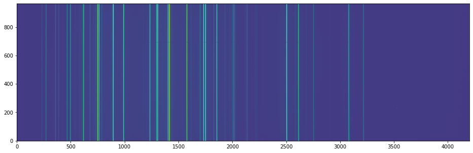
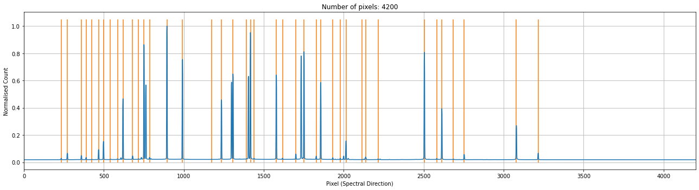
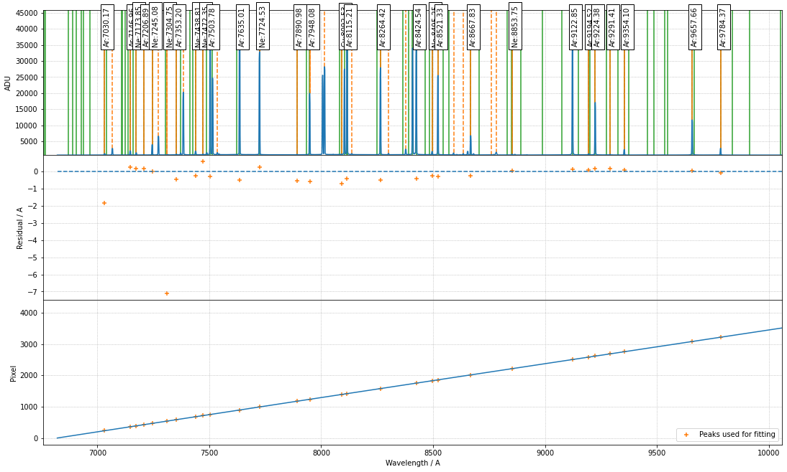
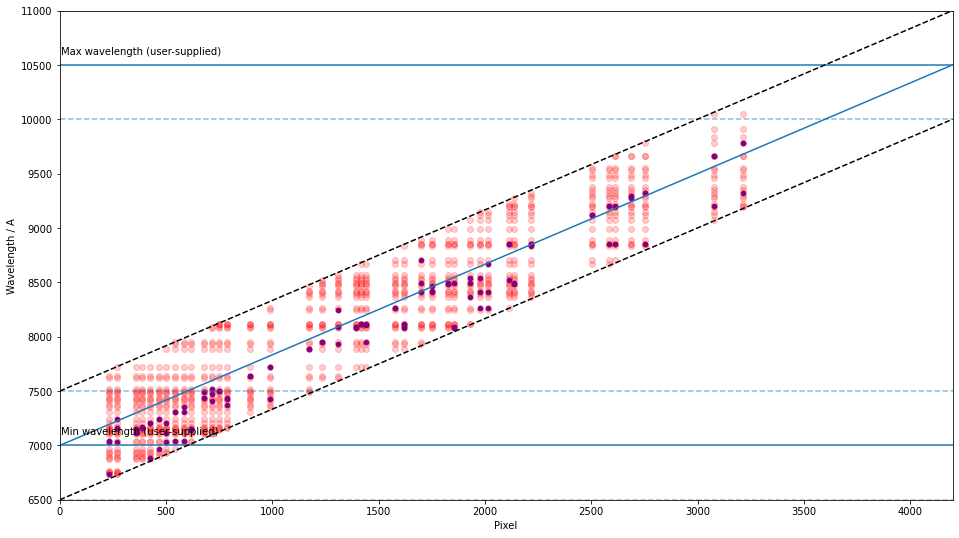

Example - WHT/ISIS
==================

The Intermediate-dispersion Spectrograph and Imaging System (`ISIS <http://www.ing.iac.es/astronomy/instruments/isis/>`_) is a Cassegrain instrument on the `William Herschel Telescope <http://www.ing.iac.es/astronomy/telescopes/wht/>`_. Like most instruments, it has many configurations, in this example, we are wavelength calibrating the R300R grating with the CuNe+CuAr lamp.

1. Initialise the environment and the line list (see the other examples for using the NIST line list) for the data proecessing

.. code-block:: python

    from astropy.io import fits
    import matplotlib.pyplot as plt
    import numpy as np
    from scipy.signal import find_peaks
    from scipy.signal import resample

    from rascal.calibrator import Calibrator
    from rascal.util import refine_peaks

    atlas = [
        4193.5, 4385.77, 4500.98, 4524.68, 4582.75, 4624.28, 4671.23, 4697.02,
        4734.15, 4807.02, 4921.48, 5028.28, 5618.88, 5823.89, 5893.29, 5934.17,
        6182.42, 6318.06, 6472.841, 6595.56, 6668.92, 6728.01, 6827.32, 6976.18,
        7119.60, 7257.9, 7393.8, 7584.68, 7642.02, 7740.31, 7802.65, 7887.40,
        7967.34, 8057.258
    ]

    element = ['Xe'] * len(atlas)

2. Load and inspect the arc image

.. code-block:: python

    data = fits.open('data_wht_isis/r2701004_red_arc.fit')[1]

    plt.figure(1, figsize=(16,5))
    plt.imshow(np.log(data.data.T), aspect='auto', origin='lower')
    plt.tight_layout()

3. Normally you should be applying the trace from the spectral image onto the arc image, but in this example, we identify the arc lines by summing over the entire frame in the spatial direction. 

.. code-block:: python

    spectrum = np.median(data.data.T, axis=0)

    peaks, _ = find_peaks(spectrum, prominence=80, distance=20, threshold=None)
    peaks_refined = refine_peaks(spectrum, peaks, window_width=3)

4. Initialise the calibrator and set the properties. There are three sets of properties: (1) the calibrator properties who concerns the highest level setting - e.g. logging and plotting; (2) the Hough transform properties which set the constraints in which the trasnform is performed; (3) the RANSAC properties control the sampling conditions.

.. code-block:: python

    c = Calibrator(peaks_refined, spectrum)

    c.set_calibrator_properties(num_pix=len(spectrum),
                                plotting_library='matplotlib',
                                log_level='info')

    c.set_hough_properties(num_slopes=10000,
                           xbins=500,
                           ybins=500,
                           min_wavelength=7000.,
                           max_wavelength=10500.,
                           range_tolerance=500.,
                           linearity_tolerance=50)

    c.add_atlas(["Ne", "Ar", "Cu"],
                min_atlas_wavelength=6000,
                max_atlas_wavelength=11000,
                min_intensity=10,
                min_distance=10,
                candidate_tolerance=10,
                constrain_poly=False,
                vacuum=False,
                pressure=101325.,
                temperature=273.15,
                relative_humidity=0.)

    c.set_ransac_properties(sample_size=5,
                            top_n_candidate=5,
                            linear=True,
                            filter_close=True,
                            ransac_tolerance=5,
                            candidate_weighted=True,
                            hough_weight=1.0)

    c.do_hough_transform()

The following `INFO` should be logged, where the first 3 lines are when the calibrator was initialised, and the last 3 lines are when the calibrator properties were set.

.. code-block:: python

    INFO:rascal.calibrator:num_pix is set to None.
    INFO:rascal.calibrator:pixel_list is set to None.
    INFO:rascal.calibrator:Plotting with matplotlib.
    INFO:rascal.calibrator:num_pix is set to 4200.
    INFO:rascal.calibrator:pixel_list is set to None.
    INFO:rascal.calibrator:Plotting with matplotlib.

5. The extracted arc spectrum and the peaks identified can be plotted with the calibrator. Note that if only peaks are provided, only the orange lines will be plotted.

.. code-block:: python

    c.plot_arc()

6. Add the line list to the calibrator and perform the hough transform on the pixel-wavelength pairs that will be used by the RANSAC sampling and fitting.

.. code-block:: python

    c.load_user_atlas(elements=element,
                      wavelengths=atlas,
                      constrain_poly=True)
    c.do_hough_transform()

6. Perform polynomial fit on samples drawn from RANSAC, the deafult option is to fit with polynomial function.

.. code-block:: python

    fit_coeff, rms, residual, peak_utilisation = c.fit(max_tries=500)
    c.plot_fit(fit_coeff,
               plot_atlas=True,
               log_spectrum=False,
               tolerance=10.)

with some INFO output looking like this:

.. code-block:: python

    INFO:rascal.calibrator:Peak at: 7032.03272057003 A
    INFO:rascal.calibrator:- matched to 7030.16748046875 A
    INFO:rascal.calibrator:Peak at: 7066.866238979784 A
    INFO:rascal.calibrator:Peak at: 7146.706486468946 A
    INFO:rascal.calibrator:- matched to 7146.95654296875 A
    INFO:rascal.calibrator:Peak at: 7173.679578238163 A
    INFO:rascal.calibrator:- matched to 7173.85205078125 A
    INFO:rascal.calibrator:Peak at: 7206.739705323605 A
    INFO:rascal.calibrator:- matched to 7206.892578125 A
    INFO:rascal.calibrator:Peak at: 7245.089683763745 A
    INFO:rascal.calibrator:- matched to 7245.0791015625 A
    INFO:rascal.calibrator:Peak at: 7272.789393369358 A
    INFO:rascal.calibrator:Peak at: 7311.850882354185 A
    INFO:rascal.calibrator:- matched to 7304.75390625 A
    INFO:rascal.calibrator:Peak at: 7353.675782032377 A
    INFO:rascal.calibrator:- matched to 7353.20361328125 A
    INFO:rascal.calibrator:Peak at: 7383.976473141233 A
    INFO:rascal.calibrator:Peak at: 7439.086420302527 A
    INFO:rascal.calibrator:- matched to 7438.80712890625 A
    INFO:rascal.calibrator:Peak at: 7471.789387421437 A
    INFO:rascal.calibrator:- matched to 7472.3466796875 A
    INFO:rascal.calibrator:Peak at: 7504.0775689945185 A
    INFO:rascal.calibrator:- matched to 7503.7763671875 A
    INFO:rascal.calibrator:Peak at: 7535.9467914563065 A
    INFO:rascal.calibrator:Peak at: 7635.527653296165 A
    INFO:rascal.calibrator:- matched to 7635.01171875 A
    INFO:rascal.calibrator:Peak at: 7724.2916173416315 A
    INFO:rascal.calibrator:- matched to 7724.52685546875 A
    INFO:rascal.calibrator:Peak at: 7891.547551265124 A
    INFO:rascal.calibrator:- matched to 7890.97607421875 A
    INFO:rascal.calibrator:Peak at: 7948.68404307157 A
    INFO:rascal.calibrator:- matched to 7948.07568359375 A
    INFO:rascal.calibrator:Peak at: 8015.266095970854 A
    INFO:rascal.calibrator:Peak at: 8093.237023885084 A
    INFO:rascal.calibrator:- matched to 8092.53125 A
    INFO:rascal.calibrator:Peak at: 8115.647151051324 A
    INFO:rascal.calibrator:- matched to 8115.20751953125 A
    INFO:rascal.calibrator:Peak at: 8136.9823474983705 A
    INFO:rascal.calibrator:Peak at: 8264.92957037352 A
    INFO:rascal.calibrator:- matched to 8264.4169921875 A
    INFO:rascal.calibrator:Peak at: 8300.622776221953 A
    INFO:rascal.calibrator:Peak at: 8377.93242372805 A
    INFO:rascal.calibrator:Peak at: 8424.969864843704 A
    INFO:rascal.calibrator:- matched to 8424.5400390625 A
    INFO:rascal.calibrator:Peak at: 8495.507558139581 A
    INFO:rascal.calibrator:- matched to 8495.25 A
    INFO:rascal.calibrator:Peak at: 8521.649655751076 A
    INFO:rascal.calibrator:- matched to 8521.33203125 A
    INFO:rascal.calibrator:Peak at: 8591.500778968331 A
    INFO:rascal.calibrator:Peak at: 8634.822380309419 A
    INFO:rascal.calibrator:Peak at: 8668.074138404148 A
    INFO:rascal.calibrator:- matched to 8667.83203125 A
    INFO:rascal.calibrator:Peak at: 8761.821578994182 A
    INFO:rascal.calibrator:Peak at: 8781.595744197106 A
    INFO:rascal.calibrator:Peak at: 8853.730475790377 A
    INFO:rascal.calibrator:- matched to 8853.7509765625 A
    INFO:rascal.calibrator:Peak at: 9122.730835375478 A
    INFO:rascal.calibrator:- matched to 9122.8466796875 A
    INFO:rascal.calibrator:Peak at: 9194.447034742407 A
    INFO:rascal.calibrator:- matched to 9194.5166015625 A
    INFO:rascal.calibrator:Peak at: 9224.23302586336 A
    INFO:rascal.calibrator:- matched to 9224.376953125 A
    INFO:rascal.calibrator:Peak at: 9291.251217839615 A
    INFO:rascal.calibrator:- matched to 9291.408203125 A
    INFO:rascal.calibrator:Peak at: 9354.010724203863 A
    INFO:rascal.calibrator:- matched to 9354.0966796875 A
    INFO:rascal.calibrator:Peak at: 9657.622355120493 A
    INFO:rascal.calibrator:- matched to 9657.65625 A
    INFO:rascal.calibrator:Peak at: 9784.483780841349 A
    INFO:rascal.calibrator:- matched to 9784.37109375 A

7. Quantify the quality of fit

.. code-block:: python

    print("RMS: {}".format(rms))
    print("Stdev error: {} A".format(np.abs(residual).std()))
    print("Peaks utilisation rate: {}%".format(peak_utilisation*100))

with these output

.. code-block:: python

    RMS: 0.6826146587462325
    Stdev error: 0.5576730885022209 A
    Peaks utilisation rate: 53.65853658536586%

8. We can also inspect the search space in the Hough parameter-space where the samples were drawn by running:

.. code-block:: python

    c.plot_search_space()

